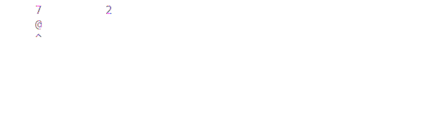
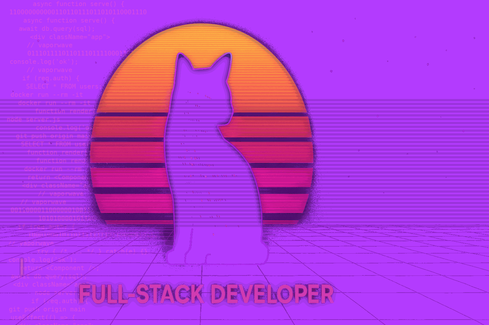

<header >

  

    
  

  

</header>

  

  

  

  

<h2 style="text-align: center; font-family: 'Arial', sans-serif; color: #9B59B6; font-size: 24px; text-shadow: 3px 3px 10px rgba(148, 0, 211, 0.6);">
  🌈
    Vamos construir um mundo onde ideias se transformam em código, desafios viram soluções e cada linha escrita é uma declaração de propósito.
  
</h2>

  

<blockquote style="text-align: center; font-family: 'Arial', sans-serif; color: #9B59B6; font-size: 18px; text-shadow: 3px 3px 10px rgba(148, 0, 211, 0.6); border: none;">
  🚩 Sou um militante e ativista do Open Source. 
  Acredito que a verdadeira evolução tecnológica só acontece com liberdade e democratização da tecnologia. 
  Vamos, juntos, compartilhar conhecimentos e construir um futuro mais livre e colaborativo!
   ☭ 
</blockquote>

  

<h2 style="text-align: center; font-size: 24px">
  
    <strong>Aqui eu espero que você:</strong>
  
</h2>

<h3 style="text-align: left; font-family: 'Arial', sans-serif; color: #9B59B6; font-size: 24px; text-shadow: 3px 3px 10px rgba(148, 0, 211, 0.6);">
  🌌
  
    <strong>Explore</strong>
  
</h3>

Tudo que você vê aqui funciona (quase sempre 😅) e foi criado para ser experimentado. Navegue pelos projetos, teste online, explore cada detalhe. Aqui não há segredos, só inovação compartilhada.

<h3 style="text-align: left; font-family: 'Arial', sans-serif; color: #9B59B6; font-size: 24px; text-shadow: 3px 3px 10px rgba(148, 0, 211, 0.6);">
  🌟
  
    <strong>Clone, faça fork e transforme</strong>
  
</h3>

Faça um fork, clone, mexa, adapte. O código é aberto e cada experimentação é uma nova realidade paralela no multiverso.

<h3 style="text-align: left; font-family: 'Arial', sans-serif; color: #9B59B6; font-size: 24px; text-shadow: 3px 3px 10px rgba(148, 0, 211, 0.6);">
  🤝
  
    <strong>Contribua à sua maneira</strong>
  
</h3>

Correções, ideias, melhorias, feedbacks ou até sugestões inusitadas: tudo conta! Se você quiser contribuir, seja bem-vindo! ❤️

---

<!-- ========================================================= -->
<!-- =======================  SKILLS  ======================== -->
<!-- ========================================================= -->
<h2 style="text-align: center; font-family: 'Arial', sans-serif; font-size: 32px; color: #9B59B6; text-shadow: 3px 3px 10px rgba(148, 0, 211, 0.6); margin-top: 60px;">✨
  
    Tech Stack
  
</h2>

---

<!-- ========================================================= -->
<!-- =======================  PROJETOS  ===================== -->
<!-- ========================================================= -->
<h2 style="text-align: center; font-family: 'Arial', sans-serif; font-size: 32px; color: #9B59B6; text-shadow: 3px 3px 10px rgba(148, 0, 211, 0.6); margin-top: 60px;">🌟
  
    Showcase Repositories
  
</h2>

<!-- Tocador de Rádio Online -->
<h3 style="text-align: center; font-family: 'Arial', sans-serif; font-size: 32px; color: #9B59B6; text-shadow: 3px 3px 10px rgba(148, 0, 211, 0.6); margin-top: 60px;">
  🎧 <a href="https://github.com/carlosfreires/TocadorDeRadioOnline" style="background: linear-gradient(to right, #8A2BE2, #FF6347); -webkit-background-clip: text; color: transparent; text-shadow: 0 0 5px rgba(138,43,226,0.8), 0 0 10px rgba(255,99,71,0.8);"><strong>Tocador De Radio Online</strong></a>
</h3>

  Este projeto é um tocador de rádio online, desenvolvido com Angular CLI 19.0.2, que permite reprodução de links de rádios online ou outras fontes. O layout homenageia astronomia e ufologia, com uma réplica animada do sistema solar e uma nave espacial no ponteiro do mouse.

  🔗 <a href="https://carlosfreires.github.io/TocadorDeRadioOnline/" style="color:#FF6347; text-decoration:none;"><strong>GitHub Pages</strong></a>

---

<!-- TV Online -->
<h3 style="text-align: center; font-family: 'Arial', sans-serif; font-size: 32px; color: #9B59B6; text-shadow: 3px 3px 10px rgba(148, 0, 211, 0.6); margin-top: 60px;">
  📺 <a href="https://github.com/carlosfreires/tvOnline" style="background: linear-gradient(to right, #8A2BE2, #FF6347); -webkit-background-clip: text; color: transparent; text-shadow: 0 0 5px rgba(138,43,226,0.8), 0 0 10px rgba(255,99,71,0.8);"><strong>TV Online</strong></a>
</h3>

  Projeto simples de TV ao vivo via URLs M3U, exibindo canais com nomes e logos, permitindo seleção para reprodução em tempo real.

  🔗 <a href="https://carlosfreires.github.io/tvOnline/" style="color:#FF6347; text-decoration:none;"><strong>GitHub Pages</strong></a>

---

<!-- Webcam Page -->
<h3 style="text-align: center; font-family: 'Arial', sans-serif; font-size: 32px; color: #9B59B6; text-shadow: 3px 3px 10px rgba(148, 0, 211, 0.6); margin-top: 60px;">
  🎥 <a href="https://github.com/carlosfreires/webcam_page" style="background: linear-gradient(to right, #8A2BE2, #FF6347); -webkit-background-clip: text; color: transparent; text-shadow: 0 0 5px rgba(138,43,226,0.8),0 0 10px rgba(255,99,71,0.8);"><strong>Webcam Page</strong></a>
</h3>

  Captura e grava vídeo e áudio da webcam/microfone, permite download e reprodução de gravações.

  🔗 <a href="https://carlosfreires.github.io/webcam_page/" style="color:#FF6347; text-decoration:none;"><strong>GitHub Pages</strong></a>

---

<!-- Gerador de Hash -->
<h3 style="text-align: center; font-family: 'Arial', sans-serif; font-size: 32px; color: #9B59B6; text-shadow: 3px 3px 10px rgba(148,0,211,0.6); margin-top: 60px;">
  🔐 <a href="https://github.com/carlosfreires/geradorDeHash-bcrypt" style="background: linear-gradient(to right, #8A2BE2, #FF6347); -webkit-background-clip: text; color: transparent; text-shadow: 0 0 5px rgba(138,43,226,0.8),0 0 10px rgba(255,99,71,0.8);"><strong>Gerador De Hash - bcrypt</strong></a>
</h3>

  Script em Node.js que utiliza bcrypt para gerar hashes seguros de senhas, resistente a ataques de força bruta.

---

<!-- Monitor de Dispositivos -->
<h3 style="text-align: center; font-family: 'Arial', sans-serif; font-size: 32px; color: #9B59B6; text-shadow: 3px 3px 10px rgba(148,0,211,0.6); margin-top: 60px;">
  🖥️ <a href="https://github.com/carlosfreires/Projeto_MonitorDeDispositivosEmRede_backend" style="background: linear-gradient(to right, #8A2BE2, #FF6347); -webkit-background-clip: text; color: transparent; text-shadow: 0 0 5px rgba(138,43,226,0.8),0 0 10px rgba(255,99,71,0.8);"><strong>Monitor De Dispositivos Em Rede</strong></a>
</h3>

  Sistema para monitoramento de equipamentos, gerenciamento de usuários e logs, com ferramentas de teste de conectividade (Ping, Telnet, Tracert).

---

<!-- freires - botpress -->
<h3 style="text-align: center; font-family: 'Arial', sans-serif; font-size: 32px; color: #9B59B6; text-shadow: 3px 3px 10px rgba(148,0,211,0.6); margin-top: 60px;">
  🤖 <a href="https://github.com/carlosfreires/freires-botpress-dev" style="background: linear-gradient(to right, #8A2BE2, #FF6347); -webkit-background-clip: text; color: transparent; text-shadow: 0 0 5px rgba(138,43,226,0.8),0 0 10px rgba(255,99,71,0.8);"><strong>freires - botpress - dev</strong></a>
</h3>

  Configuração pronta para iniciar com Botpress usando Docker. Facilita criação e personalização de chatbots.

---

<!-- Docker PostgreSQL -->
<h3 style="text-align: center; font-family: 'Arial', sans-serif; font-size: 32px; color: #9B59B6; text-shadow: 3px 3px 10px rgba(148,0,211,0.6); margin-top: 60px;">
  🐘 <a href="https://github.com/carlosfreires/Docker_PostgreSQL-V13" style="background: linear-gradient(to right, #8A2BE2, #FF6347); -webkit-background-clip: text; color: transparent; text-shadow: 0 0 5px rgba(138,43,226,0.8),0 0 10px rgba(255,99,71,0.8);"><strong>Docker PostgreSQL - V13</strong></a>
</h3>

  Ambiente isolado com PostgreSQL usando Docker e Docker Compose, incluindo persistência de dados e banco inicial.

---

<!-- Docker MongoDB -->
<h3 style="text-align: center; font-family: 'Arial', sans-serif; font-size: 32px; color: #9B59B6; text-shadow: 3px 3px 10px rgba(148,0,211,0.6); margin-top: 60px;">
  🍃 <a href="https://github.com/carlosfreires/Docker_MongoDB-V4.4" style="background: linear-gradient(to right, #8A2BE2, #FF6347); -webkit-background-clip: text; color: transparent; text-shadow: 0 0 5px rgba(138,43,226,0.8),0 0 10px rgba(255,99,71,0.8);"><strong>Docker MongoDB - V4.4</strong></a>
</h3>

  Ambiente isolado para desenvolvimento e testes com MongoDB via Docker e Docker Compose.

---

<!-- Docker MySQL -->
<h3 style="text-align: center; font-family: 'Arial', sans-serif; font-size: 32px; color: #9B59B6; text-shadow: 3px 3px 10px rgba(148,0,211,0.6); margin-top: 60px;">
  🐬 <a href="https://github.com/carlosfreires/Docker_MySQL-V8" style="background: linear-gradient(to right, #8A2BE2, #FF6347); -webkit-background-clip: text; color: transparent; text-shadow: 0 0 5px rgba(138,43,226,0.8),0 0 10px rgba(255,99,71,0.8);"><strong>Docker MySQL - V8</strong></a>
</h3>

  Ambiente isolado para desenvolvimento com MySQL via Docker e Docker Compose, incluindo persistência de dados.

---

<!-- ========================================================= -->
<!-- ==================  GITHUB SNAKE GAME  ================== -->
<!-- ========================================================= -->

<h2 style="font-size: 36px; margin-bottom: 30px;
           background: linear-gradient(45deg, #00FF00, #32CD32, #ADFF2F);
           -webkit-background-clip: text; -webkit-text-fill-color: transparent;
           text-shadow: 0 0 30px rgba(0,255,0,0.3);">
  🐍 GitHub Contribution Snake
</h2>

  Minha contribuição no GitHub transformada em um jogo da cobrinha! 
  A cobrinha percorre meus commits dos últimos 52 semanas.

<!-- Imagem da cobrinha com suporte a dark mode -->
<picture>
  <source media="(prefers-color-scheme: dark)" srcset="output/github-snake-dark.svg" />
  <source media="(prefers-color-scheme: light)" srcset="output/github-snake.svg" />
  
</picture>

  

    🔄 <strong>Atualizado automaticamente a cada 6 horas</strong> • 
    🎮 <strong>Jogo da cobrinha baseado em commits</strong>
  

  

    ⚡ Tecnologia: <a href="https://github.com/Platane/snk" target="_blank" style="color: #00FFFF;">Platane/snk</a> • 
    📊 Dados: GitHub Contributions API
  

<!-- ========================================================= -->
<!-- ===================  APIs AUTOMÁTICAS ================== -->
<!-- ========================================================= -->

<!-- NASA APIs -->
<!-- BEGIN NASA_APIS -->
<!-- 🔄 NASA atualizado: 2025-12-12 17:21:25 UTC -->

<!-- ========================================================= -->
<!-- =================  EXPLORAÇÃO ESPACIAL  ================== -->
<!-- ========================================================= -->

<h2 style="text-align: center; font-size: 36px; margin-bottom: 40px; 
           background: linear-gradient(45deg, #FF416C, #FF4B2B, #8A2BE2);
           -webkit-background-clip: text; -webkit-text-fill-color: transparent;
           text-shadow: 0 0 30px rgba(255,65,108,0.3);">
  🚀 EXPLORAÇÃO COSMOS &nbsp; • &nbsp; 🌌 NASA APIs
</h2>

  

    <h3 style="color: #FF6347; text-align: center; font-size: 22px; margin: 0 0 20px 0;">
      📷 IMAGEM ASTRONÔMICA DO DIA
    </h3>
    <a href="https://apod.nasa.gov/apod/image/2512/Firefox-Lehtonen-Dennis1024.jpg" target="_blank" style="display: block; text-decoration: none;">
      

        
      

    </a>
    

      <h4 style="color: #00FFFF; font-size: 18px; margin: 10px 0;">Northern Fox Fires</h4>
      

        In a Finnish myth, when an arctic fox runs so fast that its bushy tail brushes the mountains, flaming sparks are cast into the heavens creating the northern lights. In fact the Fin...
      

      

        📅 2025-12-12
        <a href="https://apod.nasa.gov/apod/astropix.html" target="_blank" 
           style="color: #FF6347; text-decoration: none; font-size: 12px;">
          🌐 Ver no site da NASA
        </a>
      

    

  

  

    <h3 style="color: #00FFFF; text-align: center; font-size: 22px; margin: 0 0 20px 0;">
      🛰️ ESTAÇÃO ESPACIAL INTERNACIONAL
    </h3>
    

      

        

        

      

      

        

          
LATITUDE

          
-44.47°

        

        

          
LONGITUDE

          
109.49°

        

      

      

        ⚡ Velocidade: 27.600 km/h • Altura: 408 km
      

    

  

  

    🔭 Dados em tempo real via NASA API • Atualização automática diária
  

<!-- END NASA_APIS -->

<!-- NEWS APIs -->
<!-- BEGIN NEWS_APIS -->
<!-- 🔄 NOTÍCIAS TECH atualizado: 2025-12-12 17:21:25 UTC -->

<!-- ========================================================= -->
<!-- ================  NOTÍCIAS DE TECNOLOGIA  ================ -->
<!-- ========================================================= -->

<h2 style="text-align: center; font-size: 36px; margin-bottom: 40px;
           background: linear-gradient(45deg, #00FFFF, #4169E1, #8A2BE2);
           -webkit-background-clip: text; -webkit-text-fill-color: transparent;
           text-shadow: 0 0 30px rgba(0,255,255,0.3);">
  💻 TECH NEWS &nbsp; • &nbsp; 🔬 INOVAÇÃO DIGITAL
</h2>

  

    
    

      🚀
    

    
    

      
        🤖 IA
      
      
        ⏱️ 3 min
      
    

    
    <h3 style="color: #FF6347; font-size: 18px; margin: 10px 0; line-height: 1.4;">
      Inteligência Artificial Revoluciona Desenvolvimento
    </h3>
    
    

      Ferramentas de IA estão transformando como escrevemos e debugamos código.
    

    
    

      
        📅 Hoje • 🔥 Trending
      
      <button style="background: #FF6347; color: white; border: none; padding: 8px 16px;
              border-radius: 8px; font-size: 12px; cursor: pointer; transition: opacity 0.3s;"
              onmouseover="this.style.opacity='0.8'" onmouseout="this.style.opacity='1'">
        📖 Ler Artigo
      </button>
    

    
    

    

  

  

    
    

      💡
    

    
    

      
        🔓 OPEN SOURCE
      
      
        ⏱️ 4 min
      
    

    
    <h3 style="color: #00FFFF; font-size: 18px; margin: 10px 0; line-height: 1.4;">
      Open Source Atinge Novo Recorde em 2024
    </h3>
    
    

      Comunidade open source cresce com colaboração global sem precedentes.
    

    
    

      
        📅 Hoje • 🔥 Trending
      
      <button style="background: #00FFFF; color: white; border: none; padding: 8px 16px;
              border-radius: 8px; font-size: 12px; cursor: pointer; transition: opacity 0.3s;"
              onmouseover="this.style.opacity='0.8'" onmouseout="this.style.opacity='1'">
        📖 Ler Artigo
      </button>
    

    
    

    

  

  

    
    

      ⚡
    

    
    

      
        ⚡ JAVASCRIPT
      
      
        ⏱️ 5 min
      
    

    
    <h3 style="color: #FFD700; font-size: 18px; margin: 10px 0; line-height: 1.4;">
      JavaScript Domina Desenvolvimento Web Moderno
    </h3>
    
    

      Ecossistema JavaScript expande com novas frameworks e ferramentas.
    

    
    

      
        📅 Hoje • 🔥 Trending
      
      <button style="background: #FFD700; color: white; border: none; padding: 8px 16px;
              border-radius: 8px; font-size: 12px; cursor: pointer; transition: opacity 0.3s;"
              onmouseover="this.style.opacity='0.8'" onmouseout="this.style.opacity='1'">
        📖 Ler Artigo
      </button>
    

    
    

    

  

  

    
    

      🔬
    

    
    

      
        🐍 PYTHON
      
      
        ⏱️ 4 min
      
    

    
    <h3 style="color: #9B59B6; font-size: 18px; margin: 10px 0; line-height: 1.4;">
      Python Lidera em Data Science & Machine Learning
    </h3>
    
    

      Python se consolida como linguagem preferida para IA e análise de dados.
    

    
    

      
        📅 Hoje • 🔥 Trending
      
      <button style="background: #9B59B6; color: white; border: none; padding: 8px 16px;
              border-radius: 8px; font-size: 12px; cursor: pointer; transition: opacity 0.3s;"
              onmouseover="this.style.opacity='0.8'" onmouseout="this.style.opacity='1'">
        📖 Ler Artigo
      </button>
    

    
    

    

  

  

    
    

      🌐
    

    
    

      
        🐳 DEVOPS
      
      
        ⏱️ 6 min
      
    

    
    <h3 style="color: #4169E1; font-size: 18px; margin: 10px 0; line-height: 1.4;">
      DevOps e Containers Transformam Infraestrutura
    </h3>
    
    

      Docker e Kubernetes revolucionam deployment de aplicações em escala.
    

    
    

      
        📅 Hoje • 🔥 Trending
      
      <button style="background: #4169E1; color: white; border: none; padding: 8px 16px;
              border-radius: 8px; font-size: 12px; cursor: pointer; transition: opacity 0.3s;"
              onmouseover="this.style.opacity='0.8'" onmouseout="this.style.opacity='1'">
        📖 Ler Artigo
      </button>
    

    
    

    

  

  

    
📡

    

      

        MANTENHA-SE ATUALIZADO
      

      

        O mundo da tecnologia evolui rápido. Estas são as tendências do momento.
      

    

  

<!-- END NEWS_APIS -->

<!-- CAT APIs -->
<!-- BEGIN CAT_APIS -->
<!-- 🔄 GATO DO DIA atualizado: 2025-12-12 17:21:26 UTC -->

<!-- ========================================================= -->
<!-- ==================  MOMENTO FELINO  ====================== -->
<!-- ========================================================= -->

  
  <!-- Elementos decorativos -->
  

  

  <h2 style="text-align: center; font-size: 36px; margin-bottom: 40px;
             background: linear-gradient(45deg, #FFD700, #FF6347, #FFA500);
             -webkit-background-clip: text; -webkit-text-fill-color: transparent;
             text-shadow: 0 0 30px rgba(255,215,0,0.3);">
    😻 MOMENTO FELINO &nbsp; • &nbsp; ✨ PAUSA INSPIRADORA
  </h2>

  

    
    <!-- Card da Imagem -->
    

      

        
        

          
        

        
        

          
            🐾 Fofura Garantida
          
          
            😸 Anti-stress
          
          
            💡 Inspiração
          
        

        
        

          

            "Um gato olhando fixamente para a tela pode ser um desenvolvedor em outra vida."
          

        

      

    

    
    <!-- Card da Citação -->
    

      

        
        

          
            🚀 PERSEVERANÇA
          
        

        
        

          

            "
          

          
          

            O sucesso é a soma de pequenos esforços repetidos dia após dia.
          

          
          

            

              

                

                  — Robert Collier
                

                

                  📚 Sabedoria para desenvolvedores
                

              

              
                ⏱️ 3 min de reflexão
              
            

          

        

      

      
      

        

          
💡

          

            

              DICA PARA DEVS:
            

            

              Assim como gatos precisam de pausas, desenvolvedores precisam de momentos de criatividade.
            

          

        

      

    

  

  

    

      😺 <em>"Os gatos têm tudo: admiração, sono sem fim, e companhia apenas quando querem."</em> 
      — Rudyard Kipling • Última atualização automática
    

  

<!-- END CAT_APIS -->

<!-- ... resto do README permanece igual ... -->