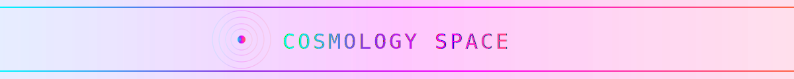
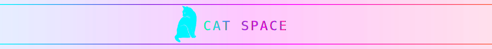

<picture>
  
</picture>

<picture>
  
</picture>

<picture>
  
</picture>

<picture>
  
</picture>

<picture>
  
</picture>

<picture>
  
</picture>

<!-- ========================================================= -->
<!-- =======================   STATS  ======================== -->
<!-- ========================================================= -->

<picture>
  
</picture>

<!-- ==================  GITHUB SNAKE GAME  ================== -->
<picture>
  
</picture>

  <tr style="border: none; background-color: transparent;">
    <td style="border: none; background-color: transparent;">
      <picture>
        
      </picture>
    </td>
  </tr>

<picture>
  

    <!-- O div externo gerencia o layout horizontal -->
    

      <!-- Primeiro Cartão (Metrics) -->
      
      
    

  

</picture>

<picture>
  
</picture>

<picture>
  
</picture>

<picture>
  
</picture>

<!-- ========================================================= -->
<!-- =======================  SKILLS  ======================== -->
<!-- ========================================================= -->

<picture>
  
</picture>

<picture>
  
</picture>

<picture>
  
</picture>

<picture>
  
</picture>

<picture>
  
</picture>

<picture>
  
</picture>

<!-- ========================================================= -->
<!-- =======================  PROJETOS  ===================== -->
<!-- ========================================================= -->
<picture>
  
</picture>

<!-- Tocador de Rádio Online -->
<picture>
  
</picture>

<picture>
  
</picture>

  
  &nbsp; 

<picture>
  
</picture>

<!-- TV Online -->

<picture>
  
</picture>

<picture>
  
</picture>

  
  &nbsp; 

<picture>
  
</picture>

<!-- Webcam Page -->

<picture>
  
</picture>

<picture>
  
</picture>

  
  &nbsp; 

<picture>
  
</picture>

<!-- Gerador de Hash -->

<picture>
  
</picture>

<picture>
  
</picture>

  

<picture>
  
</picture>

<!-- Monitor de Dispositivos -->

<picture>
  
</picture>

<picture>
  
</picture>

  

<picture>
  
</picture>

<!-- Balão Pop -->

<picture>
  
</picture>

<picture>
  
<picture>

  
  &nbsp; 

<picture>
  
</picture>
<!-- ComunaBot -->

<picture>
  
</picture>

<picture>
  
</picture>

  

<picture>
  
</picture>

<!-- Simple Portfolio -->

<picture>
  
</picture>

<picture>
  
</picture>

  
  &nbsp; 

<picture>
  
</picture>

<!-- Contador de Palavras -->

<picture>
  
</picture>

<picture>
  
</picture>

  
  &nbsp; 

<picture>
  
</picture>

<!-- freires - botpress -->

<picture>
  
</picture>

<picture>
  
</picture>

  

<picture>
  
</picture>

<!-- Docker PostgreSQL -->

<picture>
  
</picture>

<picture>
  
</picture>

  

<picture>
  
</picture>

<!-- Docker MongoDB -->

<picture>
  
</picture>

<picture>
  
</picture>

  

<picture>
  
</picture>

<!-- Docker MySQL -->

<picture>
  
</picture>

<picture>
  
</picture>

  

<picture>
  
</picture>

<!-- ========================================================= -->
<!-- ===================  APIs AUTOMÁTICAS ================== -->
<!-- ========================================================= -->

<!-- ========================================================= -->
<!-- =============  NASA APIs - Cards Horizontais  ============ -->
<!-- ========================================================= -->

<!-- NASA_SECTION -->
<!-- Atualizado: 2024-01-01 12:00 UTC -->

barr_cosmos.svg

<picture>
  
</picture>

<picture>
  
</picture>

<picture>
  
</picture>

🛰️ Dados em tempo real via NASA APIs • 🔄 Atualizado automaticamente a cada 4 horas

<picture>
  
</picture>

<!-- END_NASA_SECTION -->

<!-- CAT API -->
<!-- BEGIN CAT_API -->
<!-- 🔄 GATO DO DIA atualizado: 2025-12-12 17:21:26 UTC -->

<picture>
  
</picture>

<picture>
  
</picture>

<picture>
  
</picture>

<picture>
  
</picture>

<!-- END CAT_API -->

<picture>
  
</picture>

<picture>
  
</picture>