# Bem vindo a os meus repositorios

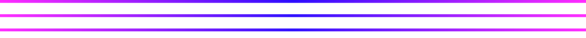

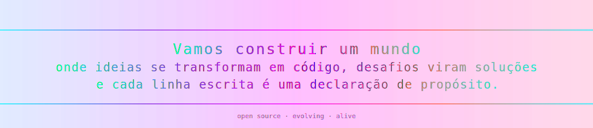

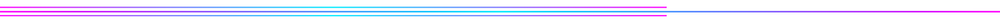

<!-- ========================================================= -->
<!-- =======================  SKILLS  ======================== -->
<!-- ========================================================= -->

<!-- ========================================================= -->
<!-- =======================  PROJETOS  ===================== -->
<!-- ========================================================= -->

<!-- Tocador de Rádio Online -->


<a href="https://carlosfreires.github.io/TocadorDeRadioOnline/" style="float: left; width: 40%; height: auto; box-sizing: border-box; padding-right: 10px;">
    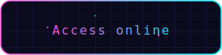
</a>

<!-- TV Online -->


<a href="https://github.com/carlosfreires/tvOnline" style="float: right; width: 40%; height: auto; box-sizing: border-box; padding-left: 10px;">
    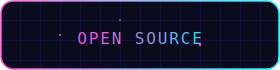
</a>

<!-- Webcam Page -->


<!-- Gerador de Hash -->


<!-- Monitor de Dispositivos -->


<!-- Balão Pop -->


<!-- ComunaBot -->


<!-- Simple Portfolio -->

<!-- Contador de Palavras -->

<!-- freires - botpress -->


<!-- Docker PostgreSQL -->


<!-- Docker MongoDB -->


<!-- Docker MySQL -->


---

<!-- ========================================================= -->
<!-- ==================  GITHUB SNAKE GAME  ================== -->
<!-- ========================================================= -->

<h2 style="font-size: 36px; margin-bottom: 30px;
           background: linear-gradient(45deg, #00FF00, #32CD32, #ADFF2F);
           -webkit-background-clip: text; -webkit-text-fill-color: transparent;
           text-shadow: 0 0 30px rgba(0,255,0,0.3);">
  🐍 GitHub Contribution Snake
</h2>

  

<!-- ========================================================= -->
<!-- ===================  APIs AUTOMÁTICAS ================== -->
<!-- ========================================================= -->

## 🚀 NASA API


<!-- NEWS APIs -->
<!-- BEGIN NEWS_APIS -->
<!-- 🔄 NOTÍCIAS TECH atualizado: 2025-12-15 12:49:09 UTC -->

<!-- ========================================================= -->
<!-- ================  NOTÍCIAS DE TECNOLOGIA  ================ -->
<!-- ========================================================= -->

<h2 style="text-align: center; font-size: 36px; margin-bottom: 40px;
           background: linear-gradient(45deg, #00FFFF, #4169E1, #8A2BE2);
           -webkit-background-clip: text; -webkit-text-fill-color: transparent;
           text-shadow: 0 0 30px rgba(0,255,255,0.3);">
  💻 TECH NEWS &nbsp; • &nbsp; 🔬 INOVAÇÃO DIGITAL
</h2>

  

    
    

      🚀
    

    
    

      
        🤖 IA
      
      
        ⏱️ 3 min
      
    

    
    <h3 style="color: #FF6347; font-size: 18px; margin: 10px 0; line-height: 1.4;">
      Inteligência Artificial Revoluciona Desenvolvimento
    </h3>
    
    

      Ferramentas de IA estão transformando como escrevemos e debugamos código.
    

    
    

      
        📅 Hoje • 🔥 Trending
      
      <button style="background: #FF6347; color: white; border: none; padding: 8px 16px;
              border-radius: 8px; font-size: 12px; cursor: pointer; transition: opacity 0.3s;"
              onmouseover="this.style.opacity='0.8'" onmouseout="this.style.opacity='1'">
        📖 Ler Artigo
      </button>
    

    
    

    

  

  

    
    

      💡
    

    
    

      
        🔓 OPEN SOURCE
      
      
        ⏱️ 4 min
      
    

    
    <h3 style="color: #00FFFF; font-size: 18px; margin: 10px 0; line-height: 1.4;">
      Open Source Atinge Novo Recorde em 2024
    </h3>
    
    

      Comunidade open source cresce com colaboração global sem precedentes.
    

    
    

      
        📅 Hoje • 🔥 Trending
      
      <button style="background: #00FFFF; color: white; border: none; padding: 8px 16px;
              border-radius: 8px; font-size: 12px; cursor: pointer; transition: opacity 0.3s;"
              onmouseover="this.style.opacity='0.8'" onmouseout="this.style.opacity='1'">
        📖 Ler Artigo
      </button>
    

    
    

    

  

  

    
    

      ⚡
    

    
    

      
        ⚡ JAVASCRIPT
      
      
        ⏱️ 5 min
      
    

    
    <h3 style="color: #FFD700; font-size: 18px; margin: 10px 0; line-height: 1.4;">
      JavaScript Domina Desenvolvimento Web Moderno
    </h3>
    
    

      Ecossistema JavaScript expande com novas frameworks e ferramentas.
    

    
    

      
        📅 Hoje • 🔥 Trending
      
      <button style="background: #FFD700; color: white; border: none; padding: 8px 16px;
              border-radius: 8px; font-size: 12px; cursor: pointer; transition: opacity 0.3s;"
              onmouseover="this.style.opacity='0.8'" onmouseout="this.style.opacity='1'">
        📖 Ler Artigo
      </button>
    

    
    

    

  

  

    
    

      🔬
    

    
    

      
        🐍 PYTHON
      
      
        ⏱️ 4 min
      
    

    
    <h3 style="color: #9B59B6; font-size: 18px; margin: 10px 0; line-height: 1.4;">
      Python Lidera em Data Science & Machine Learning
    </h3>
    
    

      Python se consolida como linguagem preferida para IA e análise de dados.
    

    
    

      
        📅 Hoje • 🔥 Trending
      
      <button style="background: #9B59B6; color: white; border: none; padding: 8px 16px;
              border-radius: 8px; font-size: 12px; cursor: pointer; transition: opacity 0.3s;"
              onmouseover="this.style.opacity='0.8'" onmouseout="this.style.opacity='1'">
        📖 Ler Artigo
      </button>
    

    
    

    

  

  

    
    

      🌐
    

    
    

      
        🐳 DEVOPS
      
      
        ⏱️ 6 min
      
    

    
    <h3 style="color: #4169E1; font-size: 18px; margin: 10px 0; line-height: 1.4;">
      DevOps e Containers Transformam Infraestrutura
    </h3>
    
    

      Docker e Kubernetes revolucionam deployment de aplicações em escala.
    

    
    

      
        📅 Hoje • 🔥 Trending
      
      <button style="background: #4169E1; color: white; border: none; padding: 8px 16px;
              border-radius: 8px; font-size: 12px; cursor: pointer; transition: opacity 0.3s;"
              onmouseover="this.style.opacity='0.8'" onmouseout="this.style.opacity='1'">
        📖 Ler Artigo
      </button>
    

    
    

    

  

  

    
📡

    

      

        MANTENHA-SE ATUALIZADO
      

      

        O mundo da tecnologia evolui rápido. Estas são as tendências do momento.
      

    

  

<!-- END NEWS_APIS -->

<!-- CAT APIs -->
<!-- BEGIN CAT_APIS -->
<!-- 🔄 GATO DO DIA atualizado: 2025-12-12 17:21:26 UTC -->

<!-- ========================================================= -->
<!-- ==================  MOMENTO FELINO  ====================== -->
<!-- ========================================================= -->

  
  <!-- Elementos decorativos -->
  

  

  <h2 style="text-align: center; font-size: 36px; margin-bottom: 40px;
             background: linear-gradient(45deg, #FFD700, #FF6347, #FFA500);
             -webkit-background-clip: text; -webkit-text-fill-color: transparent;
             text-shadow: 0 0 30px rgba(255,215,0,0.3);">
    😻 MOMENTO FELINO &nbsp; • &nbsp; ✨ PAUSA INSPIRADORA
  </h2>

  

    
    <!-- Card da Imagem -->
    

      

        
        

          
        

        
        

          
            🐾 Fofura Garantida
          
          
            😸 Anti-stress
          
          
            💡 Inspiração
          
        

        
        

          

            "Um gato olhando fixamente para a tela pode ser um desenvolvedor em outra vida."
          

        

      

    

    
    <!-- Card da Citação -->
    

      

        
        

          
            🚀 PERSEVERANÇA
          
        

        
        

          

            "
          

          
          

            O sucesso é a soma de pequenos esforços repetidos dia após dia.
          

          
          

            

              

                

                  — Robert Collier
                

                

                  📚 Sabedoria para desenvolvedores
                

              

              
                ⏱️ 3 min de reflexão
              
            

          

        

      

      
      

        

          
💡

          

            

              DICA PARA DEVS:
            

            

              Assim como gatos precisam de pausas, desenvolvedores precisam de momentos de criatividade.
            

          

        

      

    

  

  

    

      😺 <em>"Os gatos têm tudo: admiração, sono sem fim, e companhia apenas quando querem."</em> 
      — Rudyard Kipling • Última atualização automática
    

  

<!-- END CAT_APIS -->

<!-- ... resto do README permanece igual ... -->
